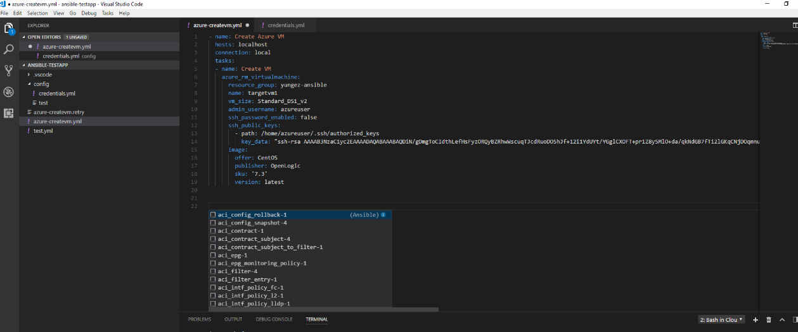

# Visual Studio Code extension for Ansible

## Overview
This extension is to help user use ansible in VSCode.

## Features

- Author ansible playbook efficiently
  - Code snippets.  Press `Ctrl + Space`, ansible playbook code snippets will show up.
  - Syntax highlighting.

- Run ansible from Visual Studio Code
  - From Terminal.
    - On Windows, run ansible inside docker.
    - On Non-windows platform, provide option to run ansible from docker or from local ansible installation.
  - From [Cloud Shell](https://azure.microsoft.com/en-us/features/cloud-shell/).  
    Run ansible playbook in Cloud Shell, user will need install Azure Account extension and sign in to Azure. Please refer to Usage section for more detail.

## Requirements

|platform|prerequisite|
|--------|-----------|
|Windows|docker|

## Usage
- Code snippets  
    Press `Ctrl + Space` in playbook yml file, you'll see ansible modules code snippets.    
    

- Run ansible playbook commands  
  Press `F1`, type `ansible` in command platte, you'll see two ansible commands: *Run Ansible Playbook in Terminal* and *Run Ansible Playbook in Cloud Shell*.
  
  - Run Ansible Playbook in Terminal
    1. Input playbook file full path, or use default one.
    2. This step is optinal. If you'll run ansible cloud provider modules, you'll need set cloud provider credentials in credential yaml file, default path is $HOME/.vscode/ansible-credentials.yml, or change credential file path by settings item  `ansible.credentialsFile`. Credential file template is at [here](https://github.com/VSChina/vscode-ansible/blob/readme1/config/credentials.yml).
    3. On Non-Windows platform, choose option `docker` or `local`.

  - Run Ansible Playbook in [Cloud Shell](https://azure.microsoft.com/en-us/features/cloud-shell/)
    1. Install [Azure Account](https://marketplace.visualstudio.com/items?itemName=ms-vscode.azure-account) VSCode extension, which is used for Azure login. If you haven't installed this extension, you'll see an error message prompted.
    2. Input playbook file full path, or use default one.
    3. Confirm awareness on Azure usage fee.
    4. Azure login.

- Configuration  
  This extension provides 2 configurations in settings.json.
  - ansible.credentialsFile  
    This configuration is used to specify ansible credentials file path. Default is $HOME/.vscode/ansible-credential.yml.
  - ansible.termininalInitCommand  
    This configuration is used to specify customized terminal init command. Default is docker run commands for docker, and 'ansible-playbook' for local setup.

## Feedback and Questions
You can submit bug or feature suggestion via [issues](https://github.com/VSChina/vscode-ansible/issues/new).

## License
[MIT license](./LICENSE.md).

## Telemetry
This extension collects telemetry data to help improve our products. Please read [Microsoft privacy statement](https://privacy.microsoft.com/en-us/privacystatement) to learn more.

