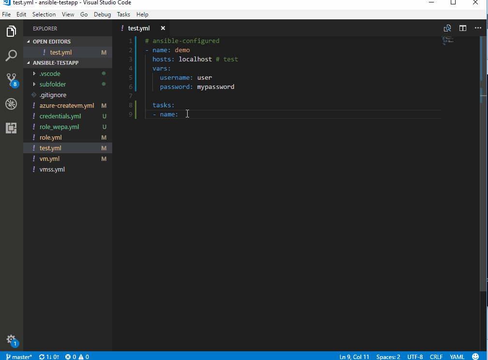
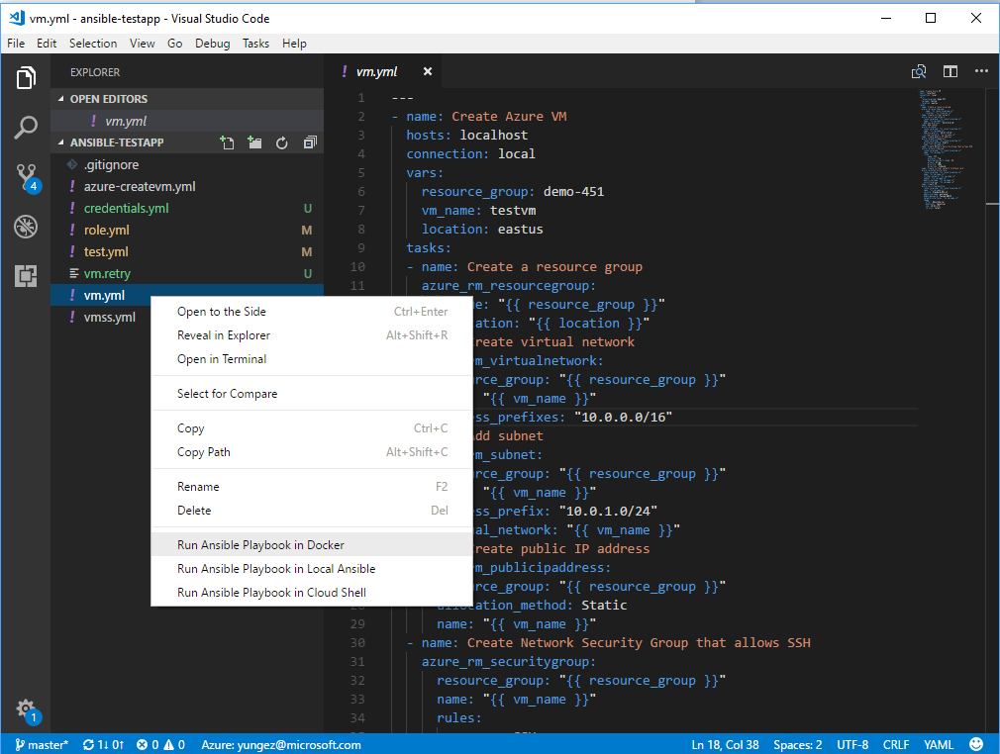
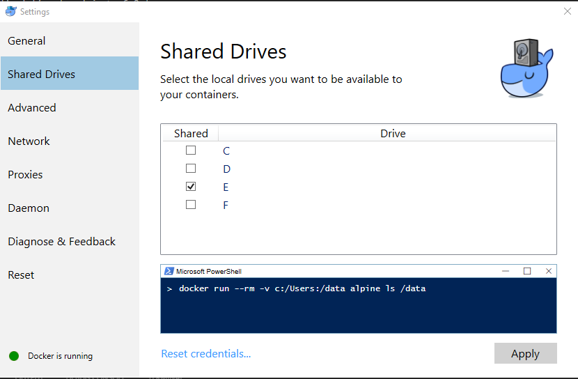

[](https://travis-ci.org/VSChina/vscode-ansible)
[](https://ci.appveyor.com/project/yungez/vscode-ansible)
[](https://marketplace.visualstudio.com/items?itemName=vscoss.vscode-ansible)

# Visual Studio Code extension for [Ansible](https://www.ansible.com/)
The VSCode ansible extension is designed to increase developer productivity authoring, testing and using Ansible with Azure. The extension provides cool features around playbook authoring and execution. It supports running playbook from various places e.g. Docker, local installation, remote machines via ssh and [Cloud Shell](https://azure.microsoft.com/en-us/features/cloud-shell/).

## Table of Content
- [Features](#features)
- [Configuration](#configuration)
- [Prerequisites](#prerequisites)
- [Usage](#usage) 
   - [Code Snippets](#code-snippets)
   - [Syntax highlighting](#syntax-highlighting)
   - Yaml validation
   - [Run Ansible playbook](#run-ansible-playbook) 
       - [Run Playbook in Docker](#run-playbook-in-docker)
       - [Run Playbook in Local Ansible](#run-playbook-in-local-ansible)
       - [Run Playbook in Cloud Shell](#run-playbook-in-cloud-shell)
       - [Run Playbook Remotely via ssh](#run-playbook-remotely-via-ssh)
       - [Auto File Copy on saving](#files-copy-to-remote-on-saving)
   - [Samples for azure_rm_resource](#samples-for-azure_rm_resource-preview)
- [Feedback and Questions](#feedback-and-questions)
- [License](#license)
- [Telemetry](#telemetry)
- [Contributing](#contributing)


## Features

  - Auto completion. Auto completion Ansible directives, modules and plugins from Ansible doc, Auto completion for variables. Disable auto completion by setting `ansible.autocompletion` to `false`.
  - Code snippets.  Press `Ctrl + Space`, Ansible playbook code snippets will show up.
  - Syntax highlighting. Enable syntax highlighting by setting `files.associations` to `ansible` in `settings.json`.
  - Yaml validation. Yaml validation by leverage [Yaml language server](https://github.com/redhat-developer/yaml-language-server).
  - Code navigation by Symbols, press `Ctrl + Shift + O`.
  - Hover over module names, to show module documentation. Disable hovering over by setting `ansible.hover` to `false`.
  - Run playbook from Docker.
  - Run playbook from local Ansible installation.
  - Run playbook from [Cloud Shell](https://azure.microsoft.com/en-us/features/cloud-shell/). 
  - Run playbook remotely via ssh.
  - Auto File Copy to remote host on saving.

## Configuration  
This extension provides below configurations in settings.json.


|Config Name| Default Value| Description|
|--|--|--|
|`ansible.autocompletion` | `true` | Enable/Disable ansible autocompletion(including code snippets) functionality. To enable ansible autocompletion only in specific yaml files, set `ansible.autocompletion = false`, then add `# ansible-configured` header in first line of yaml file.|
|`ansible.hover`| `true`| Enable/Disable hover over module name functionality. |
|`ansible.reuseSSHTerminal`|`true`| Enable/Disable SSH terminal reusing. |
|`ansible.credentialsFile` |`$HOME/.vscode/ansible-credentials.yml` |Specify ansible credentials file path, used when run playbook in Docker/Local Ansible. |
|`ansible.termininalInitCommand`|Default is `docker run` command for Docker.| Specify customized terminal init command when run playbook in Docker. |
|`ansible.dockerImage`|`microsoft/ansible:latest`|Docker image name when running playbook in Docker.|
|`ansible.customOptions`| `null` | Customize run playbook options. eg. `-i xxxx -vvv`.|
|`ansible.fileCopyConfig`| `null` | File copying configuration when running playbook remotely via SSH. It's array of configuration. Please see detail at [here](#files-copy-to-remote-on-saving)|


## Prerequisites

|platform|prerequisite|
|--------|-----------|
|Run Playbook in Cloud Shell/Remotely via ssh| nodejs >= 6.0 |
|Run Playbook in Docker|Docker|
|Run Playbook in Local Ansible| Ansible |

## Usage
Associate your Yaml files with `ansible` language in VSCode `settings.json`:
```
   "files.associations": {
        "**/*.yml": "ansible"
    },
```

### Code snippets  
Code snippets will be in auto-completed list with suffix `_snippet`. Press `tab` to move inside snippet parameters. 


### Syntax highlighting
Enable syntax highlighting by adding `files.associations` in `settings.json`, to associate your paths with `ansible` language, please see [sample](#usage).


### Run Ansible playbook   

  
#### Run Playbook in Docker
1. Make sure Docker is installed and running. For non-Windows platform, please configure Docker run without sudo.
1. Default docker image is [microsoft/ansible:latest](https://hub.docker.com/r/microsoft/ansible/tags/), which is latest Ansible version. Customizing your own docker image by configuration item `ansible.dockerImage`, customizing docker init command by configuration `ansible.termininalInitCommand`, eg. `docker run -i -t microsoft/ansible:ansible2.5.5 /bin/bash`. Detail please see [configuration](#configuration).
1. For Windows user, please share your Windows driver where vscode workspace sits on with docker. This is because the extension will map your workspace containing playbook with docker.   

1. This step is optional. If you want to run cloud provider specific Ansible modules, you need set cloud credentials in credential yaml file, default path is `$HOME/.vscode/ansible-credentials.yml`, or change credential file path by settings item  `ansible.credentialsFile`. Credential file template is at [here](https://github.com/VSChina/vscode-ansible/blob/master/config/credentials.yml).    
1. Press `F1`, type: `Ansible`, choose `Run Ansible Playbook in Docker`. Or right click playbook yaml file, choose `Run Ansible Playbook in Docker`.


    ***NOTE***  
    - Docker on Windows is not as stable as on other platforms, please try to restart Docker in case of any issue.
    - Downloading Docker image first time usage may be time consuming in case of slow network connection.

#### Run Playbook in Local Ansible
1. Make sure Ansible is installed.
1. This step is optional. If you want to run cloud provider specific Ansible modules, please setup cloud credentials by following [Ansible instruction](http://docs.ansible.com/ansible/latest/guides.html). Or you can set cloud credentials in credential file, default path is `$HOME/.vscode/ansible-credentials.yml`, change credential file path by settings item  `ansible.credentialsFile`. Credential file template is at [here](https://github.com/VSChina/vscode-ansible/blob/master/config/credentials.yml).  
1. Press `F1`, type: `Ansible`, choose `Run Ansible Playbook in Local Ansible`. Or right click playbook yaml file, choose `Run Ansible Playbook in Local Ansible`.


#### Run Playbook in Cloud Shell
1. **Important** Please setup Cloud Shell for first time usage in Azure Portal by following [this instruction](https://docs.microsoft.com/en-us/azure/cloud-shell/overview). After setup, input cmd `az account show` to learn your current subscription setting.
1. Install [Azure Account](https://marketplace.visualstudio.com/items?itemName=ms-vscode.azure-account) VSCode extension, which is used for Azure login.
1. Press `F1`, type: `Azure: Sign In`, do Azure login.
1. Press `F1`, type: `Ansible`, choose `Run Ansible Playbook in Cloud Shell`. Or right click playbook yaml file, choose `Run Ansible Playbook in Cloud Shell`.
1. Confirm awareness on Azure usage fee. Please refer to [this document](https://docs.microsoft.com/en-us/azure/cloud-shell/pricing) to learn more about Azure Cloud Shell pricing.
1. **Known issue** due to [adal issue](https://github.com/AzureAD/azure-activedirectory-library-for-nodejs/issues/197), introduced in [azure account](https://github.com/Microsoft/vscode-azure-account/issues/53) extension, user might see `Entry not found` error when connect to cloud shell. Please retry open cloud shell.
    
#### Run Playbook Remotely via ssh
1. Press `F1`, choose `Run Ansible Playbook Remotely via ssh`, follow wizard to pick up/add remote host. Or configure your remote server in `$HOME/.ssh/servers.json` like below.
   ```
   [
        {
            "host": "your host",
            "port": 22,
            "user": "your user name",
            "password": "your ssh password",
            "key": "your private key",
            "passphrase": "your passphrase"
        }
   ]
   ```

#### Files copy to remote on saving
1. Configure file copying to remote host on saving as below in `settings.json`. `sourcePath` will be copied to remote `server` as `targetPath` when configuration added/updated. `copyOnSave` will copy local saved files to remote host.
```
    "ansible.fileCopyConfig": 
        {
            "server": "remote-host-name",
            "sourcePath": "local file/folder to copy from, eg. e:\\testfolder\\ansibleplaybooks",
            "targetPath": "remote file/folder to copy to, eg. /home/user/ansibleplaybooks",
            "copyOnSave": true // When true, files saved inside VSCode will be copied automatically to remote host.
        }
    ]
```
There's notification message at right side of status bar.

## Samples for azure_rm_resource (Preview)

This command provides sample code snippets for [azure_rm_resource](https://docs.ansible.com/ansible/latest/modules/azure_rm_resource_module.html) module, those samples are from [Azure Rest API spec](https://github.com/Azure/azure-rest-api-specs.git).

To use, press **F1** and then select **Ansible: Samples for azure_rm_resource (PREVIEW)** command.
You will be first asked for API group, then required operation. After selecting operation a pickup list will be displayed where you can select particular API version and sample. Extension will create appropriate playbook based on **azure_rm_resource** or **azure_rm_resource_facts** module.

Note that all the samples generated by the extension are based on REST API samples from this repository:

https://github.com/Azure/azure-rest-api-specs

Please also refer to Azure REST API reference here:

https://docs.microsoft.com/en-us/rest/api/?view=Azure

In case of any bugs encountered in samples please fill an issue here:

https://github.com/Azure/azure-rest-api-specs/issues

**Note 1**: This feature requires Ansible >= 2.7.

**Note 2**: When using for the first time it may take a few minutes to retrieve REST API specifications.


## Feedback and Questions
You can submit bug or feature suggestion via [issues](https://github.com/VSChina/vscode-ansible/issues/new).

## License
[MIT license](./LICENSE.md).

## Telemetry
This extension collects telemetry data to help improve our products. Please read [Microsoft privacy statement](https://privacy.microsoft.com/en-us/privacystatement) to learn more. If you opt out to send telemetry data to Microsoft, please set below configuration in settings.json:
```
telemetry.enableTelemetry = false
```

## Contributing

This project welcomes contributions and suggestions.  Most contributions require you to agree to a Contributor License Agreement (CLA) declaring that you have the right to, and actually do, grant us the rights to use your contribution. For details, visit https://cla.microsoft.com.

This project has adopted the [Microsoft Open Source Code of Conduct](https://opensource.microsoft.com/codeofconduct/).
For more information see the [Code of Conduct FAQ](https://opensource.microsoft.com/codeofconduct/faq/) or
contact [opencode@microsoft.com](mailto:opencode@microsoft.com) with any additional questions or comments.

Please see below documents to learn how to contribute:
- [How to build, run and debug from source](https://github.com/VSChina/vscode-ansible/wiki/How-to-Contribute)
- [Coding Guidelines](https://github.com/VSChina/vscode-ansible/wiki/Coding-Guidelines)


## Release Notes and Thank you
Please see our [releases](https://github.com/VSChina/vscode-ansible/releases) to see detail in each release, and `Thank you`. Or check [CHANGELOG](./CHANGELOG.md).
